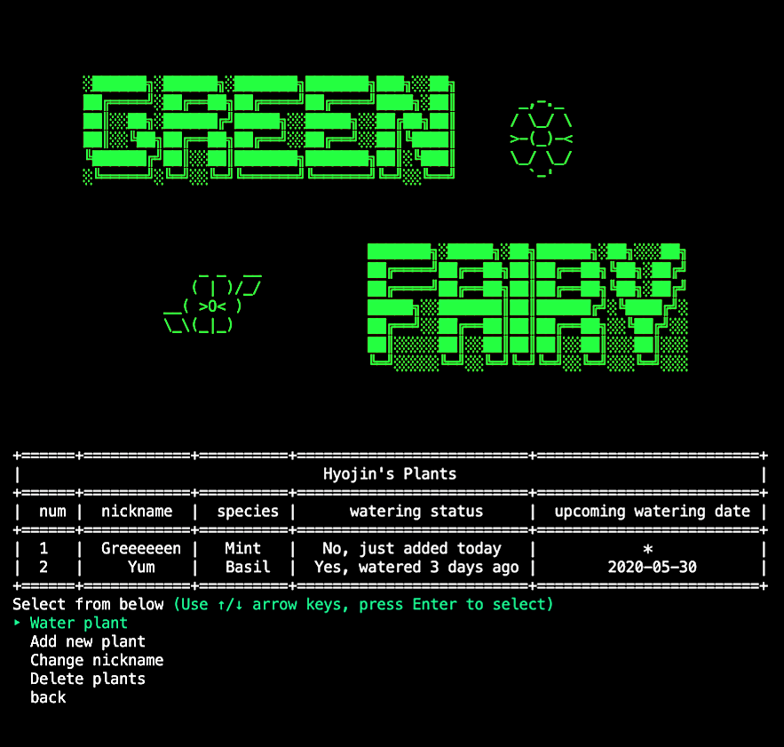

Green Fairy
========================

Green Fairy is a CLI app that helps you to schedule and manage watering your plants.
Built using Ruby and Active Record.

---

## Getting Started

1. Clone this repository onto your local machine.
2. Run `bundle install` to download all the necessary gems.
3. Run `rake db:migrate` to create the database.
4. Run `rake db:seed` to seed the database with some auto-generated data.
5. Once you've installed everything smoothly, run `ruby bin/run.rb` to start the app!

## Main Menu
* create an username
* See all my plants
* Add new plant
* Delete my account
* Quit

## Sub Menu
* Water plant -> (change watering status or cycle)
* Add new plant
* Change nickname
* Delete plants

---

## Built With

Below are some Gems and links that I used:

* [Faker] (https://github.com/faker-ruby/faker): fake data generator
* [TTY::Prompt] (https://github.com/piotrmurach/tty-prompt): interactive command line prompt
* [Paint] (https://github.com/janlelis/paint/): simple, fast and powerful way to add colors to text
* [Terminal-table] (https://github.com/tj/terminal-table): ASCII Table Generator, simple and feature rich
* [Text to ASCII Art Generator] (https://fsymbols.com/generators/carty/): generates ASCII fonts
* [ASCII Art Collection] (https://asciiart.website/): Christopher Johnson's ASCII Art Collection
* [ASCII Art Archive] (https://www.asciiart.eu/): collection of ASCII art

